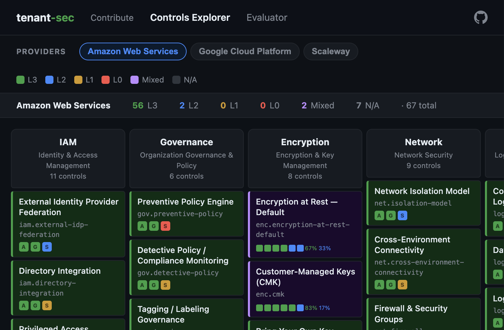

# tenant-sec

An open-source framework for evaluating cloud provider security capabilities at the **tenant level** — the controls and features a cloud customer can actually use, configure, and rely on.

[](https://your-org.github.io/tenant-sec/controls.html)

> **[Explore controls visually](https://your-org.github.io/tenant-sec/controls.html)** · **[Try the in-browser evaluator](https://your-org.github.io/tenant-sec/evaluate.html)** · **[Read the docs](https://your-org.github.io/tenant-sec/)**

## Why this exists

Standard compliance frameworks assess security controls as binary predicates — implemented or not. When the bar is "does this capability exist?", every major provider passes, and the assessment stops being useful for differentiating real security posture.

Three things get lost:

- **Nuance** — a control you build and maintain with custom automation scores the same as a fully managed, policy-driven platform capability
- **Per-service gaps** — CMK encryption on S3 but not on the managed database; WAF on EC2 but not for the AI platform
- **Signal** — when every provider checks the same boxes, security teams end up doing ad-hoc deep dives to find what the framework was supposed to surface

tenant-sec replaces binary pass/fail with a **4-level maturity scale** and a **mixed composite** for per-service variability — preserving the signal that binary frameworks collapse.

## Maturity levels

| Level | Label | Meaning |
|-------|-------|---------|
| **L0** | Impossible from tenant space | Platform does not expose this capability |
| **L1** | Requires own processing loop | Achievable only with tenant-built automation |
| **L2** | Available managed, limited | Managed capability exists, limited configurability |
| **L3** | Available managed, customizable | Full managed, policy-driven capability |
| **MIX** | Mixed composite | Varies per service — contains per-service breakdown |

## What's in the box

- **67 controls** across 9 domains (IAM, Governance, Encryption, Network, Logging, Data, Compute, Incident, Supply Chain)
- **3 provider assessments** (AWS, GCP, Scaleway) with evidence text and per-service breakdowns
- **Scoring engine** — weighted domain scores, configurable mixed aggregation, must-have filters
- **Framework mappings** — CSA CCM v4.1 and NIST SP 800-53 Rev 5
- **Interactive tools** — browser-based [Controls Explorer](https://your-org.github.io/tenant-sec/controls.html) and [Evaluator](https://your-org.github.io/tenant-sec/evaluate.html) (no install required)

## Quick start

```bash
pip install tenant-sec
# With visualization extras (matplotlib, plotly):
pip install "tenant-sec[viz]"

# Validate a provider profile
tenant-sec validate providers/scaleway.yaml

# Score and rank providers against a scoring profile
tenant-sec score --profile profiles/eu-regulated-fintech.yaml

# Per-control detail for a provider
tenant-sec detail --provider aws --domain encryption

# Side-by-side comparison
tenant-sec compare --providers aws,gcp,scaleway --domain iam

# Export a provider profile
tenant-sec export --provider aws --format html -o aws-report.html
```

## Repository structure

```
tenant-sec/
├── schema/            # JSON Schemas (draft 2020-12) + service catalog
├── controls/          # 67 control definitions (one YAML per control)
├── providers/         # Provider assessment profiles (AWS, GCP, Scaleway)
├── mappings/          # Framework cross-references (CCM, NIST 800-53)
├── profiles/          # Example scoring profiles
├── docs/              # Static site — Controls Explorer, Evaluator, landing page
└── src/tenant_sec/    # CLI + scoring engine
```

## Licensing

- **Code** (`src/`): [Apache License 2.0](LICENSE)
- **Data** (`controls/`, `providers/`, `mappings/`, `profiles/`): [CC BY 4.0](LICENSE-DATA)
